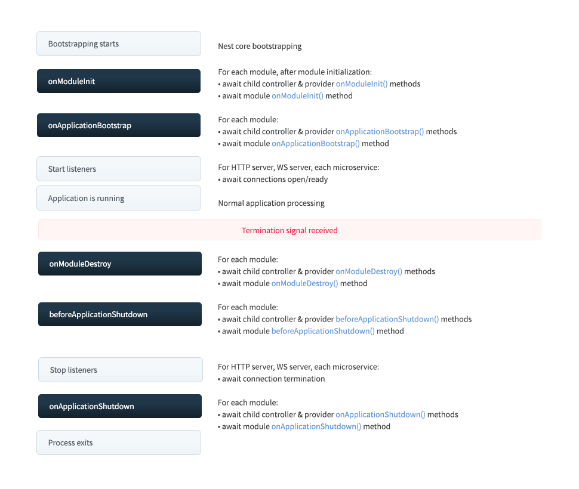

# 请求执行顺序

client side ---> middleware ---> route handle ---> middleware ---> client side
当路由使用`use`装饰器时，第一个装饰器运行结束，视为 route handle 运行结束

client side ---> guard ---> interceptor ---> pipe ---> route handle ---> interceptor ---> client side

# 补强：

**_全局守卫，排除特定路由？_**
全局守卫需要自己实例化，
reflector 不会被依赖注入需要自己实例化（知识点）

根据 request 对象中的路由来判断？
根据 SetMetadata 来判断（怎么注入 reflector 实例）
有没有更好的办法

# 问题与解答：

- 定义装饰器的位置对功能模块是否有影响
  比如：把`SetMetadata`放在守卫上面，守卫里的`Reflector`是否会取不到值
  各个功能模块的位置好像是已经被定义好了，所以装饰器的位置并不会影响其执行的顺序

- 模块间的相互引用
  比如：有一个父模块和若干子模块和子服务，在父模块中导入这些子模块，在子模块中可以使用其他子模块吗？
  不可以，如果 A 模块依赖 B 模块，B 模块又依赖 A 模块，参考[循环依赖](#循环依赖)

- DI sub-trees 是个什么东西
  [详见](#注册-request-提供者)

- [所有请求注入](#所有请求注入)，[循环依赖](#循环依赖)关系将导致非常痛苦的副作用，什么副作用

# 概述

## 控制器

控制器负责处理传入的**请求**和向客户端返回**响应**。

## 提供者

Nest 有一个内置的控制反转（"IoC"）容器，可以解决 providers 之间的关系。@Injectable() 装饰器只是冰山一角, 并不是定义 providers 的唯一方法。相反，您可以使用普通值、类、异步或同步工厂。

### 基于属性的注入 **_(不是很懂)_**

如果顶级类依赖于一个或多个 providers，那么通过从构造函数中调用子类中的 super() 来传递它们就会非常烦人了。因此，为了避免出现这种情况，可以在属性上使用 @Inject() 装饰器。

## 模块

模块是具有`@Module()`装饰器的类。`@Module()`装饰器提供了元数据，Nest 用它来组织应用程序结构


每个 Nest 应用程序至少有一个模块，即根模块。根模块是 Nest 开始安排应用程序树的地方。

除了根模块，其他模块至少需要注册一次（就是在其他模块中导入（`imports`）），全局模块建议在根模块中注册

## 中间件

1. 中间件运行在路由控制函数之前
2. 修改 request 和 reponse 对象
3. 挂起请求，运行下一个中间件，结束请求

### 类中间件

### 函数中间件

## 异常过滤器

## 管道

管道是具有`@Injectable`装饰器的类，管道应实现`PipeTransform`接口。

- **转换**：将输入数据转换为所需的数据输出
- **验证**：对输入数据进行验证，如果验证成功继续传递，验证失败则抛出异常
  它们将在验证路由参数，查询字符串参数，和请求体正文的情景中工作。

在路由处理函数上对处理函数中的每一个参数使用

当使用路由管道的时候，路由处理函数的每一个参数都会调用管道

管道的执行顺序：
当一个路由处理函数上同时有路由管道和参数管道
先执行路由管道（根据路由管道定义的顺序执行，最后将执行结果传给参数管道处理），
再执行参数管道（根据管道定义的顺序执行）。

根据路由函数定义的参数顺序反向依次应用以上规则（先执行完路由管道，再执行参数管道）

实体类 可以用 `implements` 实现`type`，结合 prisma 的类型实现转换和验证
场景一：根据 id 从数据库查找用户实体返回

```ts
@Get(':id')
findOne(@Param('id', UserByIdPipe) userEntity: UserEntity) {
  return userEntity;
}
```

## 守卫

守卫是一个使用`@Injectable`装饰器的类。守卫应该实现`CanActivate`接口。
守卫在中间件之后，在拦截器和管道之前
**授权**：它们根据运行时出现的某些条件（例如权限，角色，访问控制列表等）来确定给定的请求是否由路由处理程序处理。这通常称为授权。

使用`useGuards`守卫的执行顺序与定义顺序相同

## 拦截器

拦截器是使用`@Injectable()`装饰器注解的类。拦截器应该实现`NestInterceptor`接口。

- 在函数执行前后绑定额外的逻辑
- 转换从函数返回的结果
- 转换从函数抛出的异常
- 扩展基本函数行为
- 根据所选条件完全重写函数（例如：缓存目的）

使用`UseInterceptors`根据定义顺序执行（洋葱模型），返回结果作为上一个执行函数的`next.handle`返回值

## 自定义装饰器

### 参数装饰器

更改 request response 的属性

### 装饰器聚合

执行顺序？
与定义顺序无关，参考[请求执行顺序](#请求执行顺序)

# 基本原理

## 依赖注入

```ts
// cats.service.ts
import { Injectable } from "@nestjs/common";
import { Cat } from "./interfaces/cat.interface";
// 1. 用`@Injectable()`装饰器声明`CatsService`是一个可以由`Nest IoC`容器管理的类
@Injectable()
export class CatsService {
  private readonly cats: Cat[] = [];

  findAll(): Cat[] {
    return this.cats;
  }
}

// cats.controller.ts
import { Controller, Get } from "@nestjs/common";
import { CatsService } from "./cats.service";
import { Cat } from "./interfaces/cat.interface";

@Controller("cats")
export class CatsController {
  // 2. 在`CatsController`中声明一个依赖于`CatsService`令牌（token）的构造函数注入
  constructor(private readonly catsService: CatsService) {}

  @Get()
  async findAll(): Promise<Cat[]> {
    return this.catsService.findAll();
  }
}

// app.module.ts
import { Module } from "@nestjs/common";
import { CatsController } from "./cats/cats.controller";
import { CatsService } from "./cats/cats.service";

@Module({
  controllers: [CatsController],
  providers: [CatsService], //3. 将标记 `CatsService`与 `cats.service.ts`文件中的 `CatsService` 类相关联。
})
export class AppModule {}
```

依赖注入是一种控制反转（_IoC_）技术，你可以将依赖的实例化委派给*IoC*容器（在 Nestjs 应用中为 Nestjs 运行时系统），而不是必须在自己的代码中执行。

1. 用`@Injectable()`装饰器声明`CatsService`是一个可以由`Nest IoC`容器管理的类
2. 在`CatsController`中声明一个依赖于`CatsService`令牌（token）的构造函数注入
3. 在 `app.module.ts` 中，我们将标记 `CatsService`与 `cats.service.ts`文件中的 `CatsService` 类相关联。

当 `Nest IoC` 容器实例化 `CatsController` 时，它首先查找所有依赖项。 当找到 `CatsService` 依赖项时，它将对 CatsService 令牌(token)执行查找，并根据上述步骤（上面的＃3）返回 `CatsService` 类。 假定单例范围（默认行为），Nest 然后将创建 `CatsService` 实例，将其缓存并返回，或者如果已经缓存，则返回现有实例。
tips：我们忽略的一个重要方面是，分析依赖项代码的过程非常复杂，并且发生在应用程序引导期间。

## 自定义提供者

### 标准提供者

```ts
providers: [
  {
    provide: CatsService,
    useClass: CatsService,
  },
];
```

### 值提供者（useValue）

```ts
 providers: [
    {
      provide: CatsService,
      useValue: mockCatsService,
    },
  ],
```

### 非类提供者

除了使用字符串作为令牌之外，还可以使用 JavaScript Symbol。

```ts
providers: [
  {
    provide: "CONNECTION",
    useValue: connection,
  },
],
  // 我们使用 @Inject() 装饰器。这个装饰器只接受一个参数——令牌。
  @Injectable()
  export (class CatsRepository {
    constructor(@Inject("CONNECTION") connection: Connection) {}
  });
```

### 类提供者

useClass 语法允许您动态确定令牌应解析为的类。

```ts
//  例如，假设我们有一个抽象（或默认）的 ConfigService 类。 根据当前环境，我们希望 `Nest 提供配置服务的不同实现。 以下代码实现了这种策略。
const configServiceProvider = {
  provide: ConfigService,
  useClass:
    process.env.NODE_ENV === "development"
      ? DevelopmentConfigService
      : ProductionConfigService,
};

@Module({
  providers: [configServiceProvider],
})
export class AppModule {}
```

### 工厂提供者 (useFactory)

`useFactory` 语法允许动态创建提供程序。实工厂函数的返回实际的 `provider` 。
一个简单的工厂可能不依赖于任何其他的提供者。
更复杂的工厂可以自己注入它需要的其他提供者来计算结果。
对于后一种情况，工厂提供程序语法有一对相关的机制:

1. 工厂函数可以接受(可选)参数。
2. `inject` 属性接受一个提供者数组，在实例化过程中，Nest 将解析该数组并将其作为参数传递给工厂函数。这两个列表应该是相关的: Nest 将从 `inject` 列表中以相同的顺序将实例作为参数传递给工厂函数。

```ts
const connectionFactory = {
  provide: "CONNECTION",
  useFactory: (optionsProvider: OptionsProvider) => {
    const options = optionsProvider.get();
    return new DatabaseConnection(options);
  },
  inject: [OptionsProvider],
};

@Module({
  providers: [connectionFactory],
})
export class AppModule {}
```

### 别名提供者 (useExisting)

`useExisting` 语法允许您为现有的提供程序创建别名。这将创建两种访问同一提供者的方法。
在下面的示例中，(基于 string)令牌 'AliasedLoggerService' 是(基于类的)令牌 LoggerService 的别名。
假设我们有两个不同的依赖项，一个用于 'AlilasedLoggerService' ，另一个用于 LoggerService 。如果两个依赖项都用单例作用域指定，它们将解析为同一个实例。

```ts
@Injectable()
class LoggerService {
  /* implementation details */
}

const loggerAliasProvider = {
  provide: "AliasedLoggerService",
  useExisting: LoggerService,
};

@Module({
  providers: [LoggerService, loggerAliasProvider],
})
export class AppModule {}
```

### 非服务提供者

虽然提供者经常提供服务，但他们并不限于这种用途。提供者可以提供任何值。
例如，提供程序可以根据当前环境提供配置对象数组，如下所示:

```ts
const configFactory = {
  provide: "CONFIG",
  useFactory: () => {
    return process.env.NODE_ENV === "development" ? devConfig : prodConfig;
  },
};

@Module({
  providers: [configFactory],
})
export class AppModule {}
```

### **导出自定义提供者**

与任何提供程序一样，自定义提供程序的作用域仅限于其声明模块。
要使它对其他模块可见，必须导出它。
要导出自定义提供程序，我们可以使用其 _令牌_ 或完整的 _提供程序对象_。

```ts
const connectionFactory = {
  provide: "CONNECTION",
  useFactory: (optionsProvider: OptionsProvider) => {
    const options = optionsProvider.get();
    return new DatabaseConnection(options);
  },
  inject: [OptionsProvider],
};

@Module({
  providers: [connectionFactory],
  exports: ["CONNECTION"],
})
export class AppModule {}
```

## 异步提供者

其语法是使用 `useFactory` 语法的 `async/await`。工厂返回一个承诺，工厂函数可以等待异步任务。
在实例化依赖于(注入)这样一个提供程序的任何类之前，Nest 将等待承诺的解决。

```ts
{
  provide: 'ASYNC_CONNECTION',
  useFactory: async () => {
    const connection = await createConnection(options);
    return connection;
  },
}

```

### 注入

与任何其他提供程序一样，异步提供程序通过其令牌被注入到其他组件。
在上面的示例中，您将使用结构`@Inject('ASYNC_CONNECTION')`。

## 动态模块（DynamicModule）

**模块定义**像提供者和控制器这样的组件组，它们作为整个应用程序的模块部分组合在一起。
它们为这些组件提供了执行上下文或范围。
例如，模块中定义的提供程序对模块的其他成员可见，而不需要导出它们。当提供者需要在模块外部可见时，它首先从其主机模块导出，然后导入到其消费模块。

### 常规模块或静态模块的导入与 Nest 解析

```ts
// users.module.ts
import { Module } from "@nestjs/common";
import { UsersService } from "./users.service";

@Module({
  providers: [UsersService],
  exports: [UsersService],
})
export class UsersModule {}

// auth.module.ts
import { Module } from "@nestjs/common";
import { AuthService } from "./auth.service";
import { UsersModule } from "../users/users.module";

@Module({
  imports: [UsersModule],
  providers: [AuthService],
  exports: [AuthService],
})
export class AuthModule {}

// auth.service.ts
import { Injectable } from "@nestjs/common";
import { UsersService } from "../users/users.service";

@Injectable()
export class AuthService {
  constructor(private readonly usersService: UsersService) {}
  /*
    Implementation that makes use of this.usersService
  */
}
```

上述代码我们将其称为静态模块绑定。`Nest`在主模块和消费模块中已经声明了连接模块所需的所有信息。
这个过程中发生了什么。Nest 通过以下方式使 UsersService 在 AuthModule 中可用:

1. 实例化 `UsersModule` ，包括传递导入 `UsersModule` 本身使用的其他模块，以及传递的任何依赖项(参见[自定义提供程序](#自定义提供者))。

2. 实例化 `AuthModule` ，并将 `UsersModule` 导出的提供者提供给 `AuthModule` 中的组件(就像在 `AuthModule` 中声明它们一样)。

3. 在 `AuthService` 中注入 `UsersService` 实例。

### 什么是动态模块

一个模块根据其配置的不同，而拥有不同的行为。
动态模块的注册方法需要返回一个`DynamicModule`，它具有与静态模块相同的属性，外加一个称为模块（`module`）的附加属性。`module`属性用作模块的名称，并且应与模块的类名相同。

```ts
// app.module.ts
import { Module } from "@nestjs/common";
import { AppController } from "./app.controller";
import { AppService } from "./app.service";
import { ConfigModule } from "./config/config.module";

@Module({
  imports: [ConfigModule.register({ folder: "./config" })],
  controllers: [AppController],
  providers: [AppService],
})
export class AppModule {}
```

动态模块本身可以导入其他模块。
动态模块依赖于其他模块的提供程序，则可以使用可选的`imports`属性导入它们。同样，这与使用`@Module()`装饰器为静态模块声明元数据的方式完全相似。
**_对于动态模块，模块选项对象的所有属性都是可选的，模块除外_**

```ts
// config.module.ts
import { DynamicModule, Module } from "@nestjs/common";
import { ConfigService } from "./config.service";

@Module({})
export class ConfigModule {
  static register(): DynamicModule {
    return {
      module: ConfigModule,
      providers: [ConfigService],
      exports: [ConfigService],
    };
  }
}
```

定制`ConfigModule`行为的显而易见的解决方案是在静态`register()`方法中向其传递一个`options`对象。这很好地处理了将一个`options`对象传递给我们的动态模块。
那么我们如何在`ConfigModule`中使用`options`对象呢？
我们知道，我们的`ConfigModule`基本上是一个提供和导出可注入服务（`ConfigService`）供其他提供者使用。实际上我们的`ConfigService`需要读取`options`对象来定制它的行为。
我们需要将`options`对象注入`ConfigService`。当然，我们将使用依赖注入来做到这一点。
我们的`ConfigModule`提供`ConfigService`。而`ConfigService`又依赖于只在运行时提供的`options`对象。因此，在运行时，我们首先将`options`对象绑定到`Nest IoC`容器，然后让`Nest`将其注入`ConfigService`。

```ts
// Config.module.ts
import { DynamicModule, Module } from "@nestjs/common";

import { ConfigService } from "./config.service";

@Module({})
export class ConfigModule {
  static register(options): DynamicModule {
    return {
      module: ConfigModule,
      providers: [
        {
          provide: "CONFIG_OPTIONS",
          useValue: options,
        },
        ConfigService,
      ],
      exports: [ConfigService],
    };
  }
}

// Config.service.ts
import { Injectable, Inject } from "@nestjs/common";

import * as dotenv from "dotenv";
import * as fs from "fs";

import { EnvConfig } from "./interfaces";

@Injectable()
export class ConfigService {
  private readonly envConfig: EnvConfig;

  constructor(@Inject("CONFIG_OPTIONS") private options) {
    const filePath = `${process.env.NODE_ENV || "development"}.env`;
    const envFile = path.resolve(__dirname, "../../", options.folder, filePath);
    this.envConfig = dotenv.parse(fs.readFileSync(envFile));
  }

  get(key: string): string {
    return this.envConfig[key];
  }
}
```

## 注入作用域

基本上，每个提供者都可以作为一个单例，被请求范围限定，并切换到瞬态模式。
请参见下表，以熟悉它们之间的区别。
| | |
| --------- | ---------------------------------------------------------------------------------------------------------------------------------------- |
| DEFAULT | 每个提供者可以跨多个类共享。提供者生命周期严格绑定到应用程序生命周期。一旦应用程序启动，所有提供程序都已实例化。默认情况下使用单例范围。 |
| REQUEST | 在请求处理完成后，将为每个传入请求和垃圾收集专门创建提供者的新实例 |
| TRANSIENT | 临时提供者不能在提供者之间共享。每当其他提供者向 Nest 容器请求特定的临时提供者时，该容器将创建一个新的专用实例 |

### 使用

为了切换到另一个注入范围，您必须向 @Injectable() 装饰器传递一个选项对象。

```ts
import { Injectable, Scope } from "@nestjs/common";

@Injectable({ scope: Scope.REQUEST })
export class CatsService {}
```

在自定义提供者的情况下，您必须设置一个额外的范围属性。

```ts
{
  provide: 'CACHE_MANAGER',
  useClass: CacheManager,
  scope: Scope.TRANSIENT,
}

```

默认使用单例范围,并且不需要声明。如果你想声明一个单例范围的提供者,在 scope 属性中使用 Scope.DEFAULT 值。

### 控制器范围

当涉及到控制器时，传递`ControllerOptions`对象

```ts
@Controller({
  path: "cats",
  scope: Scope.REQUEST,
})
export class CatsController {}
```

### 所有请求注入

`scope`实际上是在注入链中 **冒泡** 的。
如果您的 _**控制器**_ 依赖于一个 **_请求范围的提供者_** ，这意味着您的 **_控制器_** 实际上也是 **_请求范围_** 的。

例如：`CatsController <- CatsService <- CatsReposutory`。如果您的`CatsService`是请求范围的（从理论上讲，其余的都是单例）,那么，`CatsController`也将成为请求范围的（因为必须将请求范围的实例注入到新创建的控制器中），而`CatsRepository`仍然是单例的。
**_这种情况下，[循环依赖](#循环依赖)关系将导致非常痛苦的副作用，因此，您当然应该避免创建它们_**

### 请求提供者

在 `HTTP` 应用程序中，当使用请求范围提供者时，可能需要获取原始的请求对象。
这通过注入`REQEUST`对象实现：

```ts
import { Injectable, Scope, Inject } from "@nestjs/common";
import { REQUEST } from "@nestjs/core";
import { Request } from "express";

@Injectable({ scope: Scope.REQUEST })
export class CatsService {
  constructor(@Inject(REQUEST) private readonly request: Request) {}
}
```

由于底层平台和协议不同，该功能与微服务和`GrapgQL`应用程序中，可以注入`CONTEXT`来替代`REQUEST`。
然后，你可以配置你的`context`值（在`GraphQLModule`），以包含请求作为其属性。

## 循环依赖

当两个类相互依赖时就会出现循环依赖。
`Nest`允许在提供者（`provider`）和模块（`module`）之间创建循环依赖关系。

### 正向引用（forward reference）

正向引用允许 `Nest` 引用目前尚未被定义的引用。当 `CatsService` 和 `CommonService` 相互依赖时，关系的双方都需要使用 `@Inject()` 和 `forwearRef()`，否则 `Nest` 不会实例化它们，因为所有基本元数据都不可用。

```ts
// cats.service.ts
@Injectable()
export class CatsService {
  constructor(
    @Inject(forwardRef(() => CommonService))
    private readonly commonService: CommonService
  ) {}
}

// common.service.ts
@Injectable()
export class CommonService {
  constructor(
    @Inject(forwardRef(() => CatsService))
    private readonly catsService: CatsService
  ) {}
}
```

**_实例化的顺序是不确定的。不能保证哪个构造函数会被先调用。_**

#### 模块正向引用

为了处理模块（module）之间的循环依赖，必须在模块关联的两个部分上使用 `forwardRef()`：

```ts
// cats.module.ts
@Module({
  imports: [forwardRef(() => CommonModule)],
})
export class CatsModule {}

// common.module.ts
@Module({
  imports: [forwardRef(() => CatsModule)],
})
export class CommonModule {}
```

### [模块引用(ModuleRef)](#模块参考moduleref)

## 模块参考(ModuleRef)

`Nest` 提供了一个 `ModuleRef` 类来导航到内部提供者列表，并使用注入令牌作为查找键名来获取一个引用。
`ModuleRef` 类也提供了一个动态实例化静态和范围的提供者的方法。`ModuleRef` 可以通过常规方法注入到类中：

```ts
// cats.service.ts
@Injectable()
export class CatsService {
  constructor(private moduleRef: ModuleRef) {}
}
```

### 获取实例

`ModuleRef` 实例拥有 `get()` 方法。该方法获取一个 **提供者**，**控制器** 或者通过注入 **令牌/类名** 获取一个在当前模块中 **可注入对象**。

```ts
// cats.service.ts
@Injectable()
export class CatsService implements OnModuleInit {
  private service: Service;
  constructor(private moduleRef: ModuleRef) {}

  onModuleInit() {
    this.service = this.moduleRef.get(Service);
  }
}
```

不能通过 `get()` 方法获取一个范围的提供者（暂态的或者请求范围的）。要使用[处理范围提供者](#处理范围提供者)。

要从全局上下文获取一个提供者（例如，如果提供者在不同模块中注入），向 `get()` 的第二个参数传递 `{strict:false}` 选项。

```ts
this.moduleRef.get(Service, { strict: false });
```

### 处理范围提供者

要动态处理一个范围提供者（瞬态的或者请求范围的），使用 `resolve()` 方法并将提供者的注入令牌作为参数提供给方法。

```ts
// cats.service.ts
@Injectable()
export class CatsService implements OnModuleInit {
  private transientService: TransientService;
  constructor(private moduleRef: ModuleRef) {}

  async onModuleInit() {
    this.transientService = await this.moduleRef.resolve(TransientService);
  }
}
```

`resolve()` 方法从其自身的注入容器树返回一个提供者的 **唯一实例**。每个子树都有 **_一个独一无二的上下文引用_**。_因此如果你调用该方法一次以上并进行引用比较的话，结果不同_。

```ts
// cats.service.ts
@Injectable()
export class CatsService implements OnModuleInit {
  constructor(private moduleRef: ModuleRef) {}

  async onModuleInit() {
    const transientServices = await Promise.all([
      this.moduleRef.resolve(TransientService),
      this.moduleRef.resolve(TransientService),
    ]);
    console.log(transientServices[0] === transientServices[1]); // false
  }
}
```

要在不同的 `resolve()` 调用之间产生一个单例，并保证它们共享同样生成的 DI 容器子树，向 `resolve()` 方法传递一个上下文引用，使用 `ContextIdFactory` 类来生成上下文引用。该类提供了一个 `create()` 方法，返回一个合适的独一无二的引用。

```ts
// cats.service.ts
@Injectable()
export class CatsService implements OnModuleInit {
  constructor(private moduleRef: ModuleRef) {}

  async onModuleInit() {
    const contextId = ContextIdFactory.create();
    const transientServices = await Promise.all([
      this.moduleRef.resolve(TransientService, contextId),
      this.moduleRef.resolve(TransientService, contextId),
    ]);
    console.log(transientServices[0] === transientServices[1]); // true
  }
}
```

### 注册 REQUEST 提供者

手动生成的上下文标识符(使用 ContextIdFactory.create ())表示未定义 REQUEST 提供程序的 DI 子树，因为它们没有被 Nest 依赖注入系统实例化和管理。

要为手动创建的 DI 子树注册自定义 REQUEST 对象， 使用 ModuleRef.registerRequestByContextId()方法：

```ts
const contextId = ContextIdFactory.create();
this.moduleRef.registerRequestByContextId(/* YOUR_REQUEST_OBJECT */, contextId);
```

### 获取当前子树

有时，也需要在请求上下文中获取一个请求范围提供者的实例。例如，`CatsService` 是请求范围的，要获取的`CatsRepository` 实例也被标识为请求范围。要分享同一个注入容器子树，你需要 **获取当前上下文引用** 而不是 **生成一个新的** (像前面的 ContextIdFactory.create()函数)。使用 `@Inject()` 来获取当前的请求对象。

```ts
// cats.service.ts
import { ContextIdFactory } from "@nestjs/core";
import { CatsRepository } from "cats.repository.ts";
@Injectable()
export class CatsService implements OnModuleInit {
  constructor(@Inject(REQUEST) private request: Record<string, unknown>) {}

  async onModuleInit() {
    const contextId = ContextIdFactory.getByRequest(this.request);
    const catsRepository = await this.moduleRef.resolve(
      CatsRepository,
      contextId
    );
  }
}
```

### 动态实例化自定义类

要动态实例化一个之前未注册的类作为提供者，使用模块引用的 `create() `方法。

```ts
cats.service.ts;
@Injectable()
export class CatsService implements OnModuleInit {
  private catsFactory: CatsFactory;
  constructor(private moduleRef: ModuleRef) {}

  async onModuleInit() {
    this.catsFactory = await this.moduleRef.create(CatsFactory);
  }
}
```

## 懒加载模块（LazyModuleLoader）

默认情况下，模块是主动加载的，这意味着只要应用程序加载，所有模块也会加载，无论它们是否立即需要。
虽然这对于大多数应用程序来说很好，但它可能会成为在 **_无服务器环境_** 中运行的应用程序的瓶颈，因为启动延迟（“冷启动”）至关重要。

为了按需加载模块，Nest 提供了 `LazyModuleLoader` 可以以常规方式注入到类中：

```ts
// cats.service.ts
import { lazyModuleLoader } from "@nestjs/core";

@Injectable()
export class CatsService {
  constructor(private lazyModuleLoader: LazyModuleLoader) {}
}
```

或者你可以在应用程序引导文件（`main.ts`）中获取对提供程序的引用，如下示例：

```ts
// main.ts
const lazyModuleLoader = app.get(LazyModuleLoader);
```

有了这个，您现在可以使用以下结构加载任何模块：

```ts
const { LazyModule } = await import("./lazy.module");
const moduleRef = await this.lazyModuleLoader.load(() => LazyModule);
```

懒加载模块是被缓存的，当第一次调用 `LazyModuleLoader.load` 方法。这意味着每次连续的加载 `LazyModule` 都会非常快，并且会尝试返回一个缓存的实例，而不是再次加载模块。

懒加载模块与常规 Nest 模块相同（不需要额外的修改）

```ts
// lazy.module.ts
@Module({
  providers: [LazyService],
  exports: [LazyService],
})
export class LazyModule {}
```

懒加载模块不能注册为 **全局模块**，因为这根本没有意义（因为它们是延迟注册的，当所有静态注册的模块都已实例化时，按需注册）。
同样，注册的 全局增强器（守卫，拦截器等）也无法正常工作。
获得 `LazyService` 提供者，如下：

```ts
const { LazyModule } = await import("./lazy.module");
const moduleRef = await this.lazyModuleLoader.load(() => LazyModule);

const { LazyService } = await import("./lazy.service");
const lazyService = moduleRef.get(LazyService);
```

### 懒加载 路由 网关 和 解析器

由于 Nest 中的控制器（或 GraphQL 应用程序中的解析器）代表路由/路径/主题（或查询/变异）的集合，因此你无法使用 `LazyModule` 延迟加载它们。

## 应用上下文

Nest 提供了一些应用类来简化在 **不同应用上下文之间编写应用（例如 Nest HTTP 应用，微服务和 WebSockets 应用）**。
这些应用可以用于创建通用的守卫，过滤器和拦截器，可以工作在控制器，方法和应用上下文中。

### ArgumentsHost 类

`ArgumentsHost` 类 **提供了获取传递给处理程序的参数**。它允许选择合适的上下文（例如 HTTP，RPC（微服务）或者 Websockets）来从框架中获取参数。
框架提供了 `ArgumentsHost` 的实例，作为 `host` 参数提供给需要获取的地方。例如，在异常过滤器中传入 `ArgumentsHost` 参数来调用 `catch()` 方法。

`ArgumentsHost` **简单地抽象为处理程序参数**。
例如：在 HTTP 应用中（使用 `@nestjs/platform-express` 时），`host` 对象封装了 Express 的 `[request,response,next]` 数组，`request` 是一个 `request` 对象， `response` 是一个 `response` 对象， `next` 是控制应用的请求响应循环的函数。此外，在 GraphQL 应用中，`host` 包含 `[root,args,context,info]` 数组。

### 当前应用上下文

当构建通用的守卫、过滤器和拦截器时，意味着要跨应用上下文运行，我们需要在当前运行时定义应用类型。
可以使用 `ArgumentsHost` 的 `getType()` 方法。

```ts
if (host.getType() === "http") {
  // do something that is only important in the context of regular HTTP requests (REST)
} else if (host.getType() === "rpc") {
  // do something that is only important in the context of Microservice requests
} else if (host.getType<GqlContextType>() === "graphql") {
  // do something that is only important in the context of GraphQL requests
}
```

### Host 处理程序参数

你可以在程序中使用 `host` 对象的应用方法来切换合适的应用上下文。
如下所示：

```ts
/**
 * Switch context to RPC.
 */
 interface RpcArgumentsHost {
  /**
   * Returns the data object.
   */
  getData<T>(): T;

  /**
   * Returns the context object.
   */
  getContext<T>(): T;
}
switchToRpc(): RpcArgumentsHost;


/**
 * Switch context to HTTP.
 */
interface HttpArgumentsHost {
    /**
     * Returns the in-flight `request` object.
     */
    getRequest<T = any>(): T;
    /**
     * Returns the in-flight `response` object.
     */
    getResponse<T = any>(): T;
    getNext<T = any>(): T;
}
switchToHttp(): HttpArgumentsHost;


/**
 * Switch context to WebSockets.
 */
 interface WsArgumentsHost {
  /**
   * Returns the data object.
   */
  getData<T>(): T;
  /**
   * Returns the client object.
   */
  getClient<T>(): T;
}
switchToWs(): WsArgumentsHost;
```

### 执行上下文类（ExecutionContenxt）

`ExecutionContext` 扩展了 `ArgumentsHost`, 提供额外的当前线程信息。
和 `ArgumentsHost` 类似， Nest 在需要的时候提供了一个 `ExecutionContext` 的实例，
例如守卫的 `canActivate()` 方法和拦截器的 `intercept()` 方法，它提供以下方法：

```ts
export interface ExecutionContext extends ArgumentsHost {
  /**
   * Returns the type of the controller class which the current handler belongs to.
   */
  getClass<T>(): Type<T>;
  /**
   * Returns a reference to the handler (method) that will be invoked next in the
   * request pipeline.
   */
  getHandler(): Function;
}
```

### 反射和元数据

#### @SetMetadata()

Nest 提供了通过 `@SetMetadata()` 装饰器将自定义元数据附加在路径处理程序的能力。
我们可以在类中获取这些元数据来执行特定决策。

```ts
// cats.controller.ts

@Post()
@SetMetadata('roles', ['admin'])
async create(@Body() createCatDto: CreateCatDto) {
  this.catsService.create(createCatDto);
}

```

我们可以使用 `Reflector` 辅助类来访问添加的元数据，它由框架提供，可以通过常规方式注入到类：

```ts
@Injectable()
export class RolesGuard {
  constructor(private reflector: Reflector) {}

  getRoles() {
    const roles = this.reflector.get<string[]>("roles", context.getHandler());
  }
}
```

使用 `get()` 方法读取处理程序的元数据。

#### Reflector

- get()

```ts
// 读取处理函数的元数据
const roles = this.reflector.get<string[]>("roles", context.getHandler());

// 读取路由控制器的元数据
const roles = this.reflector.get<string[]>("roles", context.getClass());
```

- getAll()

```ts
const roles = this.reflector.getAll<string[]>("roles", [
  context.getHandler(),
  context.getClass(),
]);
// [["admin"],["user"]]
```

根据 getHandler 和 getClass 的位置在返回数组中的对应位置返回获取的元数据

- getAllAndMerge()

```ts
const roles = this.reflector.getAllAndMerge<string[]>("roles", [
  context.getHandler(),
  context.getClass(),
]);
// ["admin","user"]
```

根据 getHandler 和 getClass 的位置在返回数组中的按顺序返回定义的元数据

- getAllAndOverride()

```ts
const roles = this.reflector.getAllAndOverride<string[]>("roles", [
  context.getHandler(),
  context.getClass(),
]);
// ["admin"]
```

根据 getHandler 和 getClass 的位置 **前面的元数据** 优于后面的元数据

## 生命周期事件

所有应用程序元素都有一个由 Nest 管理的生命周期。Nest 提供了生命周期钩子，提供了对关键生命时刻的可见性，以及在关键时刻发生时采取行动（在你的 `module`，`injectable` 或者 `controller`）的能力。

### 生命周期序列

下图描述了关键应用生命周期事件序列，从应用引导之时到 node 应用退出。我们可以把整个生命周期划分为三个阶段：初始化，运行和终止。使用生命周期，你可以合理计划模块和服务的初始化，管理活动链接，并且在应用程序收到终止指令时优雅地退出。


### 生命周期事件

生命周期事件在应用初始化与终止时发生。
Nest 在 modules，injectables 和 controllers 的以下每个生命周期事件中调用注册的钩子方法。
和上图所示一样，Nest 也调用合适的底层方法来监听连接，以及终止监听连接。

在下述表格中， ` onModuleDestroy``，beforeApplicationShutdown ` 和 `onApplicationShutdown` 仅仅在显式调用 `app.close()` 或者应用收到特定系统信号（例如 `SIGTERM`）并且在初始化时（参见[shutdown](#程序关闭)）正确调用了 `enableShutdownHooks` 方法后被触发。

| 生命周期钩子方法            | 生命周期时间触发钩子方法调用                                                                                  |
| --------------------------- | ------------------------------------------------------------------------------------------------------------- |
| OnModuleInit()              | 初始化主模块依赖处理后调用一次                                                                                |
| OnApplicationBootstrap()    | 在应用程序完全启动并监听连接后调用一次                                                                        |
| OnModuleDestroy()           | 收到终止信号(例如 SIGTERM)后调用                                                                              |
| beforeApplicationShutdown() | 在 onModuleDestroy()完成(Promise 被 resolved 或者 rejected)；一旦完成，将关闭所有连接(调用 app.close() 方法). |
| OnApplicationShutdown()     | 连接关闭处理时调用(app.close())                                                                               |

**_上面列出的生命周期挂钩不会为请求范围的类触发。请求作用域的类不受应用程序生命周期的约束，它们的生命周期是不可预测的。它们专门为每个请求创建，并在发送响应后自动进行垃圾收集。_**

### 使用

所有应用周期的 **_钩子都有接口表示_**，_接口在技术上是可选的_，因为它们在 TypeScript 编译之后就不存在了。
例如，要注册一个方法在特定类（例如，控制器、提供者或者模块）初始化时调用，使用 `OnModuleInit` 接口，提供 `onModuleInit()` 方法，
如下：

```ts
import { Injectable, OnModuleInit } from "@nestjs/common";

@Injectable()
export class UsersService implements OnModuleInit {
  onModuleInit() {
    console.log(`The module has been initialized.`);
  }
}
```

### 异步初始化

此外， `OnModuleInit` 和 `OnApplicationBootstrap` 钩子都允许你延迟应用程序初始化过程（返回一个 `Promise` 或在方法主体中将方法标记为 `async` 和 `await` 异步方法）。

```ts
async onModuleInit(): Promise<void> {
  await this.fetch();
}
```

### Application Shutdown

`onModuleDestroy()`，`deforeApplicationShutdown()` 和 `onApplicationShutdown()` 钩子程序响应系统终止信号（当应用程序通过调用 `app.close()` 或者收到 `SIGTERM` 系统信号时），以优雅地关闭 Nest 应用程序。
这一功能通常用于 Kubernetes、Heroku 或类似的服务。

系统关闭钩子消耗系统资源，因此默认是禁用的。要使用此钩子，必须通过 `enableShutdownHooks()` 激活侦听器。

```ts
import { NestFactory } from "@nestjs/core";
import { AppModule } from "./app.module";

async function bootstrap() {
  const app = await NestFactory.create(AppModule);
  // Starts listening to shutdown hooks
  app.enableShutdownHooks();
  await app.listen(3000);
}
bootstrap();
```

**_由于平台限制，NestJs 的关闭钩子在 Windows 下有一些限制。`SIGINT`，`SIGBREAK`以及一些 `SIGHUP` 信号可以工作–[阅读更多](https://nodejs.org/api/process.html#process_signal_events)。然而，`SIGTERM` 在 Windows 下不工作，因为在任务管理器中关闭一个线程是无条件的。“例如，应用没有办法发现或者阻止它”。一些 Windows 下关于 `SIGINT` 和 `SIGBREAK` 的 libuv 的[相关文档](https://docs.libuv.org/en/v1.x/signal.html)。参见 Nodejs 的[线程信号事件文档](https://nodejs.org/api/process.html#process_signal_events)。_**

## 测试


# 技术

## HTTP 模块

# 安全

## 认证

## 权限

验证权限
显示（前端路由生成）
增删改查

用户：
基于角色
<del>一个路由可能会改变</del>

基于权限
<del>一个添加权限不应该访问所有的添加路由</del>
一个类有多个对应多个权限（增删改查），
一个路由对应一个类的一个权限（应该是这样）

路由问题：
<del>一个路由可访问的权限是可变的，比如角色可变，权限可变</del>
路由是不可变的，可变的是用户，用户的角色，权限等

数据库建立一个 permission 表去对应路由和权限

```

```
